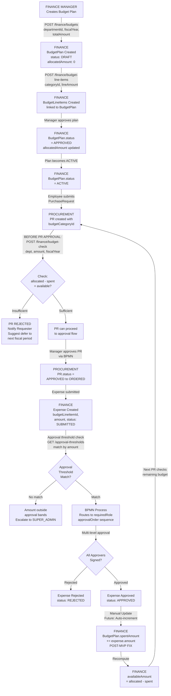
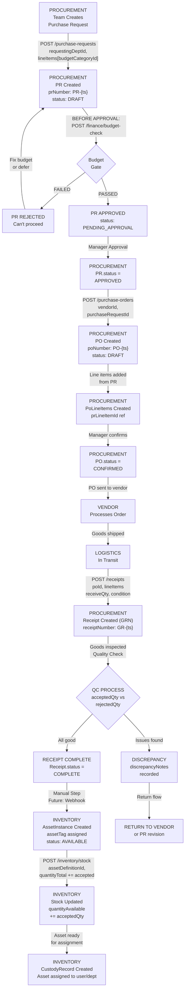
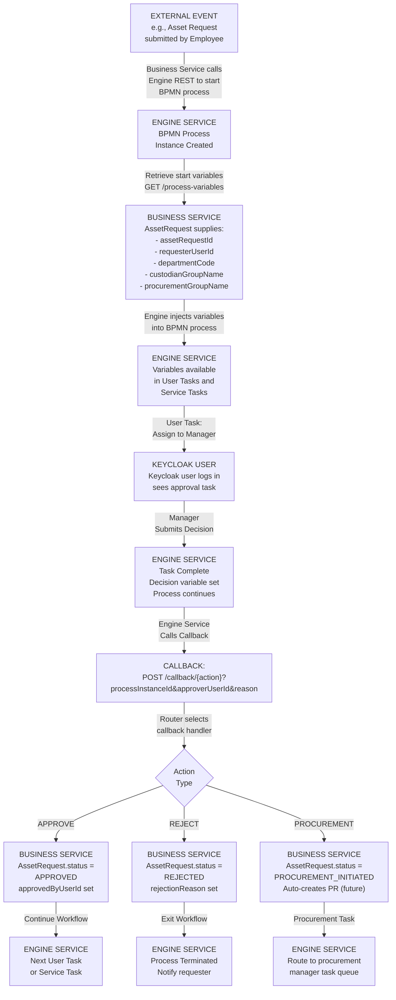
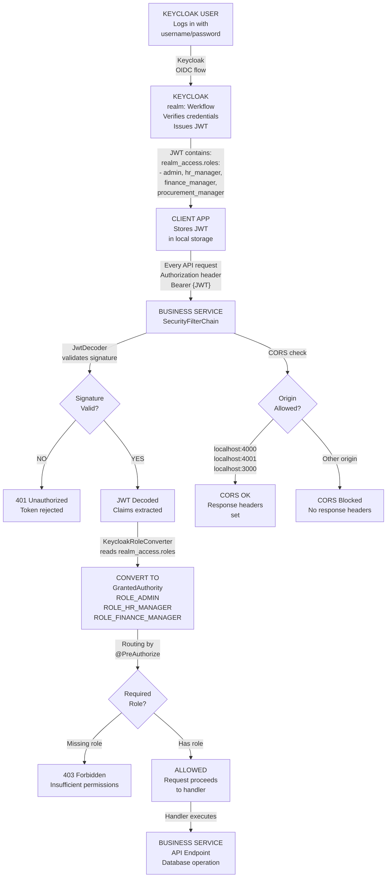

# Werkflow-ERP Architecture Overview

## Core Principle: Complete Independence

Werkflow-ERP is a **completely standalone business data service**. It has **zero dependencies** on any workflow orchestration platform, including Werkflow.

REST API Layer (Stateless, Idempotent)
  Endpoints: /api/v1/hr/*, /api/v1/finance/*, /api/v1/*

  Processing:
    - JWT validation (Spring Security)
    - Multi-tenant scoping (TenantContext)
    - Idempotency tracking (IdempotencyRecord)

Business Domain Services
  (HR, Finance, Procurement, Inventory)
  - Validation logic
  - FK constraints
  - Status state machines
  - No business rules (those are caller's concern)

Data Layer (PostgreSQL)
  4 schemas: hr_service, finance_service,
             procurement_service, inventory_service

Constraints:
  - NO EXTERNAL CALLS
  - NO WORKFLOW REFERENCES
  - NO KEYCLOAK CLIENT CODE
  - NO Werkflow IMPORTS

---

## Three Deployment Scenarios (All Use Same Code)

### Scenario 1: Standalone ERP
```
Company A (No workflow platform)
    |
    v
Custom HR App / Finance Portal
    |
    v
Werkflow-ERP REST API
    |
    v
PostgreSQL
```

Company A gets a complete ERP system without needing Werkflow.

### Scenario 2: Integrated with Werkflow (Testing)
```
Werkflow Platform
  - Engine (BPMN orchestration)
  - Admin (Users, departments)
  - Portal (Workflow designer)
  - Keycloak (Authentication)
    |
    | (via REST API)
    |
Werkflow-ERP (Business data provider)
    |
    v
PostgreSQL (shared)
```

Werkflow uses Werkflow-ERP for testing and running business workflows.

### Scenario 3: Hybrid with Multiple Orchestrators
```
Werkflow Platform     +     Zapier     +     Custom Scheduler
    |                      |                   |
    +------+-------+-------+-------+-------+---+
           |
           v
      Werkflow-ERP REST API
           |
           v
        PostgreSQL
```

Multiple systems share the same business data.

---

## Key Architectural Decisions

### 1. **Platform User ↔ HR Employee Linking (WITHOUT Coupling)**

**The Problem:**
- A person may be both a platform user (logs in) AND an HR employee (in payroll)
- But they're tracked in separate systems

**The Solution:**
- `Employee.platformUserId` is an optional field
- External systems (Werkflow, SAP, etc.) manage the linking
- Werkflow-ERP just stores the reference, doesn't validate it

```
External Platform creates user
    |
    v
Calls: PATCH /api/v1/hr/employees/{id}/platform-link
    Body: { platformUserId: "uuid-123" }
    |
    v
Werkflow-ERP stores the link
    |
    v
Later queries can find: GET /api/v1/hr/employees/platform/uuid-123
```

**Why no coupling?**
- Werkflow-ERP never calls Keycloak or any platform system
- Works with Keycloak, Azure AD, LDAP, or custom systems
- Works without any platform system (platformUserId = null is valid)

---

### 2. **Zero External Dependencies**

Werkflow-ERP MUST NOT:
  - import com.Werkflow.*;
  - import org.keycloak.admin.client.*;
  - Call Admin Service for user validation
  - Validate user IDs against external systems
  - Have hardcoded Keycloak configuration
  - Assume BPMN orchestration

Werkflow-ERP DOES:
  - Validate JWT signature (Spring Security, no client code)
  - Store user IDs as opaque strings
  - Provide status update endpoints
  - Work standalone or integrated with any caller

**CI/CD Check:**
```bash
if grep -r "import com.Werkflow" services/business/ ; then
  echo "FAIL: Werkflow-ERP has forbidden imports"
  exit 1
fi
```

---

### 3. **Status Updates (Not Workflows)**

Werkflow-ERP doesn't have "workflow callbacks". It has **simple status update endpoints**:

```
PATCH /api/v1/inventory/asset-requests/{id}/status
Body: { status: "APPROVED" }
```

This endpoint:
- [YES] Works when called by Werkflow Engine
- [YES] Works when called by Zapier
- [YES] Works when called by cron job
- [YES] Works when called by manual REST client
- [YES] Doesn't care WHO updated the status

---

### 4. **User ID is Opaque and External**

Entities store user IDs (e.g., `custodianUserId: string`), but:

- Werkflow-ERP **never validates** them against external systems
- Werkflow-ERP **never enriches** them with user names (caller's responsibility)
- Werkflow-ERP **trusts the caller** (JWT signature is validation)

```
Scenario 1: Werkflow (Keycloak user ID)
    custodianUserId = "keycloak-uuid-123"

Scenario 2: SAP integration (Employee ID)
    custodianUserId = "SAP-EMP-42"

Scenario 3: Manual testing (Email)
    custodianUserId = "alice@example.com"

All three work identically. Werkflow-ERP doesn't care.
```

---

## API Design Principles

### Stateless & Idempotent
```
POST /api/v1/procurement/purchase-requests
Headers:
  X-Idempotency-Key: "uuid-123"
  X-Tenant-ID: "acme-corp"

Response 201 (first call)
Response 200 (retry with same key)
```

### Multi-Tenant Aware
```
Every entity has: tenantId (NOT NULL)
Every query filters: WHERE tenantId = ?
No cross-tenant data leaks
```

### Pagination
```
GET /api/v1/hr/employees?page=0&size=20&sort=createdAt,desc
Response: { content: [...], pageable: { pageNumber: 0, totalElements: 1250 } }
```

### Versioned
```
[YES] /api/v1/...
[NO] /api/... (no version)

Allows v2 in future without breaking v1 clients
```

---

## Data Flow Examples

### Example 1: Werkflow Testing an Asset Request Workflow

```
1. Werkflow Portal
   User: "I need a laptop"
    (next step)
2. Werkflow Engine
   Calls: POST /api/v1/inventory/asset-requests
   Body: {
     requesterUserId: "keycloak-uuid",
     assetDefinitionId: 123,
     externalProcessId: "bpmn-proc-456"
   }
    (next step)
3. Werkflow-ERP
   [YES] Validates assetDefinitionId exists
   [YES] Stores externalProcessId for tracking
   [YES] Returns: { id: 42, status: "PENDING" }
    (next step)
4. Werkflow Engine
   [YES] Executes approval task (no Werkflow-ERP involved)
   [YES] On approval: PATCH /asset-requests/42/status
   Body: { status: "APPROVED" }
   [DONE] Werkflow-ERP updates and returns confirmation
   [YES] Routes to procurement (no Werkflow-ERP involved)
   [YES] Creates PO (no Werkflow-ERP involved)
```

Werkflow-ERP is **completely ignorant** of the approval logic, routing, or notifications.

---

### Example 2: Standalone HR System Using Werkflow-ERP

```
1. HR Portal (custom built, no workflow)
   HR Manager: Approve leave request
    (next step)
2. Direct REST call (no workflow involved)
   PATCH /api/v1/hr/leaves/99/status
   Body: { status: "APPROVED" }
    (next step)
3. Werkflow-ERP
   [YES] Updates leave record
   [YES] Returns confirmation
    (next step)
4. HR Portal
   [YES] Notifies employee (portal's responsibility)
   [YES] Updates calendar (portal's responsibility)
```

Werkflow-ERP has **no idea** that this is being used standalone.

---

## Testing Werkflow with Werkflow-ERP

Werkflow can test its workflows using Werkflow-ERP as the **data provider**:

```
Integration Test: Asset Request Workflow
├─ Start Docker: Werkflow-ERP + PostgreSQL
├─ Create test data: POST /api/v1/inventory/asset-definitions
├─ Run workflow: Deploy BPMN, start process instance
├─ Verify calls: Werkflow calls Werkflow-ERP REST APIs
├─ Check database: Confirm data stored correctly
└─ Teardown: Stop containers, reset database
```

Werkflow tests its **orchestration logic** against Werkflow-ERP's **data APIs**.

---

## What Werkflow-ERP Does NOT Know

- Whether it's being used by Werkflow, SAP, or a custom app
- What business process is using its data
- Whether approvals happened (that's the caller's problem)
- Whether notifications were sent (that's the caller's problem)
- Any workflow concepts (BPMN, tasks, gateways)
- Any platform concepts (users, roles, authentication)

Werkflow-ERP just stores and retrieves business domain data. That's it.

---

---

## Business Flow Diagrams

The following Mermaid diagrams illustrate the critical business processes that Werkflow-ERP supports. These are informational — they show how callers (Werkflow, SAP, custom apps) orchestrate Werkflow-ERP API calls. Werkflow-ERP itself has no awareness of these flows.

### 1. Asset Lifecycle Flow

```mermaid
graph TD
    A["EMPLOYEE Submits Asset Request"] -->|POST /inventory/asset-requests
procurementRequired=true| B["INVENTORY
AssetRequest Created
status: PENDING"]

    B -->|"POST /asset-requests/{id}/process-instance"| C["ENGINE SERVICE
BPMN Process Started
Variables: assetRequestId,
departmentCode,
custodianGroupName"]

    C -->|User Task:
Manager Reviews| D{"Manager
Decision"}

    D -->|APPROVE| E["INVENTORY
AssetRequest.status
= APPROVED"]
    D -->|REJECT| F["INVENTORY
AssetRequest.status
= REJECTED
END FLOW"]

    E -->|Procurement Flag
procurementRequired=true
Callback| G["INVENTORY
AssetRequest.status
= PROCUREMENT_INITIATED"]

    G -->|POST /procurement/
purchase-requests
include budgetCategoryId| H["PROCUREMENT
Purchase Request Created
status: DRAFT"]

    H -->|POST /finance/budget-check
Request: dept, amount,
fiscalYear| I{"Budget
Available?"}

    I -->|NO| J["PR REJECTED
Notify Requester
END FLOW"]
    I -->|YES| K["PROCUREMENT
PR.status =
PENDING_APPROVAL"]

    K -->|Manager Approval
via BPMN| L["PROCUREMENT
PR.status = APPROVED"]

    L -->|POST /procurement/
purchase-orders
vendorId, prId| M["PROCUREMENT
Purchase Order Created
PO.status: CONFIRMED"]

    M -->|Vendor Delivers| N["LOGISTICS
Goods in Transit"]

    N -->|POST /procurement/
receipts
poId, acceptedQty| O["PROCUREMENT
Receipt Created (GRN)
status: COMPLETE"]

    O -->|Manual Step
Future: Webhook| P["INVENTORY
AssetInstance Created
status: AVAILABLE
assetTag assigned"]

    P -->|POST /custody-records
assetId, custodianDeptId,
custodianUserId| Q["INVENTORY
CustodyRecord Created
status: ACTIVE
AssetInstance.status: IN_USE"]

    Q -->|Asset needs
relocation| R["INVENTORY
TransferRequest Created
fromDeptId to toDeptId"]

    R -->|Manager Approves| S["INVENTORY
Transfer.status =
COMPLETED
Old Custody ended
New Custody created"]

    Q -->|Maintenance
Scheduled| T["INVENTORY
MaintenanceRecord
Created
status: SCHEDULED"]

    T -->|Service completed| U["INVENTORY
MaintenanceRecord
status: COMPLETED
nextMaintenanceDate set"]
```



---

### 2. Budget Approval Flow



---

### 3. Procurement Flow (PR to PO to Receipt to Inventory)



---

### 4. Engine Service Callback Flow



---

### 5. Security and Auth Flow



---

### Diagram Legend

| Color Meaning | State |
|---|---|
| Light Blue | User or client action |
| Light Yellow | Decision point or check |
| Light Green | Success or approved state |
| Light Red | Error or rejected state |
| Light Orange | Business service action |
| Light Purple | Engine service action |
| Gray | External or vendor action |

---

## Related Documents

ADRs for this service live in the `werkflow-platform` repository, not here:

- ADR-300 Service Boundary Architecture — werkflow-platform `docs/adr/ERP-Sandbox/ADR-300-service-boundary-architecture.md` — detailed decisions
- ADR-301 API Contract Standardization — werkflow-platform `docs/adr/ERP-Sandbox/ADR-301-api-contract-standardization.md` — API design decisions
- ADR-302 User Identity and JWT Claims — werkflow-platform `docs/adr/ERP-Sandbox/ADR-302-user-identity-and-jwt-claims.md` — identity architecture
- [Independence-Checklist.md](./Independence-Checklist.md) — PR review checklist
- [ROADMAP.md](../ROADMAP.md) — Implementation plan
- [README.md](../README.md) — Quick start guide

